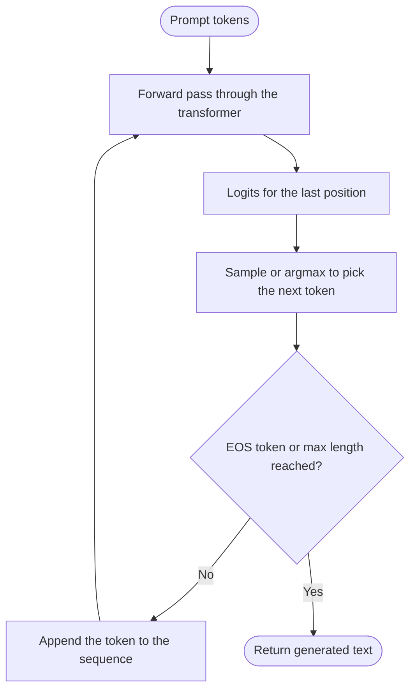

## 1. Background: Autoregressive Generation

A decoder-only LLM (GPT, Llama, Mistral, Qwen, ...) models the probability of the next token given all previous tokens:

```
P(x_t | x_1, x_2, ..., x_{t-1})
```
To generate text, we repeat this loop:



## 2. Attention Refresher (Q, K, V)

Inside every transformer layer, each token's hidden state `x` is projected into three vectors:

| Symbol | Name  | Role                                        |
|--------|-------|---------------------------------------------|
| `Q`    | Query | "What am I looking for?"                    |
| `K`    | Key   | "What do I contain / how can I be matched?" |
| `V`    | Value | "What information do I contribute?"         |

```
Q = x · W_Q
K = x · W_K
V = x · W_V

Attention(Q, K, V) = softmax( (Q · Kᵀ) / √d_k  +  causal_mask ) · V
```

**Causal mask:** token at position `i` may only attend to positions `≤ i`. This is the property that makes caching possible.

```
Attention pattern (1 = can attend, 0 = masked)

           keys →   t1  t2  t3  t4
queries ↓
   t1               1   0   0   0
   t2               1   1   0   0
   t3               1   1   1   0
   t4               1   1   1   1
```

**Key observation:** row `i` of the output depends only on `Q_i` and on `K_1..K_i`, `V_1..V_i`. Nothing about the *future* tokens influences the *past* tokens' K and V. Once computed, they are final.


**Naive approach (no cache):** run the full forward pass on `[t1, t2, t3]` again, recomputing `K1..K3` and `V1..V3` at every layer, even though they are identical to the previous step.

**The Idea: Cache K and V**

Since `K_i` and `V_i` never change after they are computed, **store them** and only compute the new token's projections each step.

**Why cache K and V but not Q?**

- `Q` is only used by the *current* token to look at the past. Once that token's output is produced, its `Q` is never needed again.
- `K` and `V` of past tokens are needed by **every future token**, at every step.


**Step-by-Step Walkthrough**

Prompt: **"The cat sat"** → we want to generate **"on"**, then **"the"**.

| Step | Phase   | Tokens fed to the model | K/V computed for | Cache contents after step        | Output |
|------|---------|-------------------------|------------------|----------------------------------|--------|
| 0    | Prefill | `The`, `cat`, `sat`     | The, cat, sat    | `[The, cat, sat]`                | `on`   |
| 1    | Decode  | `on`                    | on               | `[The, cat, sat, on]`            | `the`  |
| 2    | Decode  | `the`                   | the              | `[The, cat, sat, on, the]`       | `...`  |

Cache growth visualized (each block = one token's K and V across all layers):

```
after prefill : [The][cat][sat]
after step 1  : [The][cat][sat][on]
after step 2  : [The][cat][sat][on][the]
after step 3  : [The][cat][sat][on][the][...]
                                        ▲
                                        └── one new entry appended per step
```

**Tensor shapes** (per layer, batch size `B`, `H_kv` KV heads, head dim `D`, current length `T`):

```
K cache: [B, H_kv, T, D]
V cache: [B, H_kv, T, D]

Decode step:
  new q       : [B, H_q,  1, D]
  new k, v    : [B, H_kv, 1, D]   -> concatenated to cache along the T axis
  scores      : [B, H_q,  1, T+1]
  output      : [B, H_q,  1, D]
```

**Deep Dive into Paged KV-Cache Management in LLM Inference**

In modern Large Language Model (LLM) serving frameworks (such as vLLM, TensorRT-LLM, and SGLang), managing Key-Value (KV) cache memory efficiently is critical for maximizing throughput and sequence capacity. Traditional KV caching allocates contiguous memory per request based on the maximum sequence length, leading to severe memory fragmentation (up to 60–80% waste).

**Paged KV-Cache** solves this problem by drawing inspiration from virtual memory management in operating systems. It breaks down the continuous logical KV cache of a sequence into fixed-size physical memory blocks, allowing non-contiguous allocation in GPU VRAM.

---

## Core Data Structures & Key Parameters

To manage non-contiguous memory dynamically, the system relies on several core parameters and tracking data structures:

| Data Structure / Parameter | Type | Description |
| :--- | :--- | :--- |
| `block_size` ($B$) | Integer (Scalar) | The number of token positions stored in a single physical cache block (e.g., $B = 4$ or $16$). |
| `max_blocks` | Integer (Scalar) | The total number of physical memory blocks pre-allocated in GPU VRAM. |
| `cache_seqlens` | Array of `int32` | A 1D tensor storing the current cached sequence length for each request in the batch. |
| `block_table` | 2D Tensor `[batch_size, max_blocks_per_seq]` | A lookup table mapping a request's logical block index to its physical block ID in GPU memory. |
| `slot_mapping` | 1D Tensor `[total_tokens]` | A flattened list of physical memory slot indices assigned to every token currently being processed in the GPU kernel launch. |
| `SequenceState` | Object / Struct | Runtime metadata tracking a request's state, token counts, allocated block list, and status (e.g., Prefill vs. Decode). |

---

## Physical vs. Logical Memory Architecture

### Physical KV-Cache Layout
Instead of allocating a single large contiguous tensor per sequence, the inference engine pre-allocates two monolithic tensors in GPU memory during startup:

$$\text{K\\_Cache Shape} = [\text{max\\_blocks}, \text{block\\_size}, \text{num\\_heads}, \text{head\\_dim}]$$
$$\text{V\\_Cache Shape} = [\text{max\\_blocks}, \text{block\\_size}, \text{num\\_heads}, \text{head\\_dim}]$$

Each **Physical Block** contains $B$ slots. A **Slot** is the physical storage unit required to hold the Key and Value vectors for a single token across all attention heads and dimensions.

```
Global GPU KV Cache Memory Pool (Example with block_size = 4):
+---------------------------------------------------------------------------------+
| Block 0 : Slot 0  | Slot 1  | Slot 2  | Slot 3                                  |
+---------------------------------------------------------------------------------+
| Block 1 : Slot 4  | Slot 5  | Slot 6  | Slot 7                                  |
+---------------------------------------------------------------------------------+
| Block 2 : Slot 8  | Slot 9  | Slot 10 | Slot 11                                 |
+---------------------------------------------------------------------------------+
| ...                                                                             |
+---------------------------------------------------------------------------------+
| Block N : Slot (N*4) | Slot (N*4+1) | Slot (N*4+2) | Slot (N*4+3)                |
+---------------------------------------------------------------------------------+
```

---

## Mathematical Indexing Formulas

Given a token at logical sequence position $t$ (0-indexed) inside Sequence $i$:

### 1. Logical Block Index ($L_{\text{block}}$)

$$L_{\text{block}} = \left\lfloor \frac{t}{\text{block\\_size}} \right\rfloor$$

### 2. Offset within Block ($O_{\text{block}}$)

$$O_{\text{block}} = t \pmod{\text{block\\_size}}$$

### 3. Physical Block ID ($P_{\text{block}}$)

Look up in `block_table`:

$$P_{\text{block}} = \text{block\\_table}[i][L_{\text{block}}]$$

### 4. Global Linear Physical Slot ID ($S_{\text{physical}}$)

$$S_{\text{physical}} = (P_{\text{block}} \times \text{block\\_size}) + O_{\text{block}}$$


---

## Comprehensive Worked Example

### Scenario Setup
* **`block_size` ($B$)**: $4$
* **Batch Size**: $2$ sequences
* **`block_table`**:
  * Sequence 0: `[2, 5, 8]` $\rightarrow$ allocated physical blocks 2, 5, and 8.
  * Sequence 1: `[1, 7]` $\rightarrow$ allocated physical blocks 1 and 7.
* **`cache_seqlens`**: `[10, 6]`
  * Sequence 0 has 10 tokens cached (Tokens $0 \dots 9$).
  * Sequence 1 has 6 tokens cached (Tokens $0 \dots 5$).

> **Note on Capacity**: With $B=4$, 3 blocks can hold up to $3 \times 4 = 12$ tokens. Sequence 0 uses 10 tokens (leaving 2 empty slots in Block 8). Sequence 1 uses 6 tokens (leaving 2 empty slots in Block 7).

---

### Step-by-Step Mapping Diagram

```
Logical Sequence 0 (10 Tokens: T0 ... T9):
+----+----+----+----+   +----+----+----+----+   +----+----+--------+--------+
| T0 | T1 | T2 | T3 |   | T4 | T5 | T6 | T7 |   | T8 | T9 | [Free] | [Free] |
+----+----+----+----+   +----+----+----+----+   +----+----+--------+--------+
 Logical Block 0          Logical Block 1          Logical Block 2
        |                        |                        |
        v                        v                        v
 Physical Block 2         Physical Block 5         Physical Block 8
 (Slots 8, 9, 10, 11)     (Slots 20, 21, 22, 23)   (Slots 32, 33, 34, 35)


Logical Sequence 1 (6 Tokens: T0 ... T5):
+----+----+----+----+   +----+----+--------+--------+
| T0 | T1 | T2 | T3 |   | T4 | T5 | [Free] | [Free] |
+----+----+----+----+   +----+----+--------+--------+
 Logical Block 0          Logical Block 1
        |                        |
        v                        v
 Physical Block 1         Physical Block 7
 (Slots 4, 5, 6, 7)       (Slots 28, 29, 30, 31)
```

---

### Calculating Exact Slot Mappings

#### Sequence 0 Token Mapping
* **Tokens 0–3** (Logical Block 0 $\rightarrow$ Physical Block 2):
  * Token 0: $(2 \times 4) + 0 = \mathbf{8}$
  * Token 1: $(2 \times 4) + 1 = \mathbf{9}$
  * Token 2: $(2 \times 4) + 2 = \mathbf{10}$
  * Token 3: $(2 \times 4) + 3 = \mathbf{11}$
* **Tokens 4–7** (Logical Block 1 $\rightarrow$ Physical Block 5):
  * Token 4: $(5 \times 4) + 0 = \mathbf{20}$
  * Token 5: $(5 \times 4) + 1 = \mathbf{21}$
  * Token 6: $(5 \times 4) + 2 = \mathbf{22}$
  * Token 7: $(5 \times 4) + 3 = \mathbf{23}$
* **Tokens 8–9** (Logical Block 2 $\rightarrow$ Physical Block 8):
  * Token 8: $(8 \times 4) + 0 = \mathbf{32}$
  * Token 9: $(8 \times 4) + 1 = \mathbf{33}$

#### Sequence 1 Token Mapping
* **Tokens 0–3** (Logical Block 0 $\rightarrow$ Physical Block 1):
  * Token 0: $(1 \times 4) + 0 = \mathbf{4}$
  * Token 1: $(1 \times 4) + 1 = \mathbf{5}$
  * Token 2: $(1 \times 4) + 2 = \mathbf{6}$
  * Token 3: $(1 \times 4) + 3 = \mathbf{7}$
* **Tokens 4–5** (Logical Block 1 $\rightarrow$ Physical Block 7):
  * Token 4: $(7 \times 4) + 0 = \mathbf{28}$
  * Token 5: $(7 \times 4) + 1 = \mathbf{29}$

---

## Operations During Inference Lifecycle

```
[ Request Arrival ]
         |
         v
  +--------------+       Allocates initial physical blocks from Free Memory Pool
  | Prefill Step | ----> Computes full slot_mapping for all prompt tokens
  +--------------+       Writes K & V tensors directly into assigned slots
         |
         v
  +--------------+       Generates 1 new token per sequence
  | Decode Step  | ----> Checks if current block has space:
  +--------------+       - YES: Insert into next slot in current block
         |               - NO : Request new block from Free Pool, update block_table
         v
 [ Execution End ] ----> Free all allocated physical blocks back to Memory Pool
```

### Prefill Phase (Prompt Processing)
* **Goal**: Process input tokens simultaneously for a sequence and populate initial KV cache entries.
* **Mechanism**:
  1. The host determines how many blocks are needed: $\lceil \text{prompt\\_len} / \text{block\\_size} \rceil$.
  2. The memory allocator fetches free block IDs from the global pool and updates `block_table`.
  3. `slot_mapping` is constructed for every prompt token.
  4. The Attention kernel receives computed $K$ and $V$ tensors and uses `slot_mapping` to perform a scattered write directly into `K_Cache` and `V_Cache` global memory.

### Decode Phase (Token-by-Token Generation)
* **Goal**: Append KV vectors for a single newly generated token per sequence.
* **Mechanism**:
  1. For sequence $i$, check current token position $t = \text{cache\\_seqlens}[i]$.
  2. Determine if $t \pmod{\text{block\\_size}} == 0$:
     * If **True**: The current physical block is full. Allocate a new physical block from the free list and append its ID to `block_table[i]`.
     * If **False**: Use the existing last block in `block_table[i]`.
  3. Compute the single new slot index and append it to `slot_mapping`.
  4. Perform Attention kernel call, querying all cached tokens up to $t$ using `block_table[i]`.

---

## Python Implementation Blueprint

Here is a conceptual Python implementation demonstrating how runtime states, block tables, and slot mappings are dynamically generated.

```python
import math
from typing import List

class BlockAllocator:
    def __init__(self, total_blocks: int, block_size: int):
        self.block_size = block_size
        self.free_blocks: List[int] = list(range(total_blocks))

    def allocate(self, num_blocks: int) -> List[int]:
        if len(self.free_blocks) < num_blocks:
            raise MemoryError("Out of GPU KV Cache Memory!")
        allocated = self.free_blocks[:num_blocks]
        self.free_blocks = self.free_blocks[num_blocks:]
        return allocated

    def free(self, block_ids: List[int]):
        self.free_blocks.extend(block_ids)


class SequenceState:
    def __init__(self, seq_id: int, prompt_tokens: List[int]):
        self.seq_id = seq_id
        self.tokens = prompt_tokens
        self.allocated_blocks: List[int] = []

    @property
    def seq_len(self) -> int:
        return len(self.tokens)


def compute_slot_mapping(
    batch_sequences: List[SequenceState],
    block_tables: List[List[int]],
    block_size: int,
    is_prefill: bool = False
) -> List[int]:
    """
    Computes physical slot indices for tokens being processed in the current forward pass.
    """
    slot_mapping = []

    for seq_idx, seq in enumerate(batch_sequences):
        seq_block_table = block_tables[seq_idx]
        
        if is_prefill:
            # Calculate slot mapping for ALL tokens in prompt
            for t in range(seq.seq_len):
                logical_block = t // block_size
                offset = t % block_size
                physical_block = seq_block_table[logical_block]
                slot_id = physical_block * block_size + offset
                slot_mapping.append(slot_id)
        else:
            # Decode Phase: Calculate slot mapping ONLY for the last new token
            t = seq.seq_len - 1
            logical_block = t // block_size
            offset = t % block_size
            physical_block = seq_block_table[logical_block]
            slot_id = physical_block * block_size + offset
            slot_mapping.append(slot_id)

    return slot_mapping


# Example Verification
if __name__ == "__main__":
    BLOCK_SIZE = 4
    allocator = BlockAllocator(total_blocks=16, block_size=BLOCK_SIZE)

    # Initialize Sequences
    seq0 = SequenceState(seq_id=0, prompt_tokens=list(range(10))) # 10 tokens
    seq1 = SequenceState(seq_id=1, prompt_tokens=list(range(6)))  # 6 tokens
    
    # Pre-assign explicitly matching user example block_table = [[2, 5, 8], [1, 7]]
    block_tables = [
        [2, 5, 8],
        [1, 7]
    ]

    slots = compute_slot_mapping([seq0, seq1], block_tables, BLOCK_SIZE, is_prefill=True)
    
    print("Sequence 0 Slot Mapping (10 tokens):", slots[:10])
    print("Sequence 1 Slot Mapping (6 tokens) :", slots[10:])
```

### Script Execution Output
```text
Sequence 0 Slot Mapping (10 tokens): [8, 9, 10, 11, 20, 21, 22, 23, 32, 33]
Sequence 1 Slot Mapping (6 tokens) : [4, 5, 6, 7, 28, 29]
```

---

## 7. Key Benefits & CUDA Kernel Execution

1. **Zero Memory Waste**: Memory fragmentation is reduced from up to 80% down to $<1\%$ (at most $B-1$ token slots per sequence at any given time).
2. **Flexible Prefix Caching**: Shared prompt prefixes across different sequences (e.g., system prompts) simply map to identical physical block IDs in their respective `block_table` entries without duplicating GPU memory.
3. **Custom Kernel Gather Operations**: Custom Triton/CUDA kernels take `K_Cache`, `V_Cache`, `block_table`, and `cache_seqlens` directly as pointers. During multi-head attention computations, block lookup occurs directly on fast GPU SRAM registers without copying or reshaping tensors in global memory.
